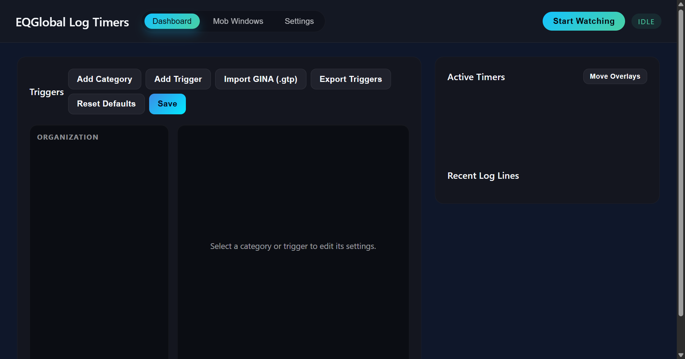
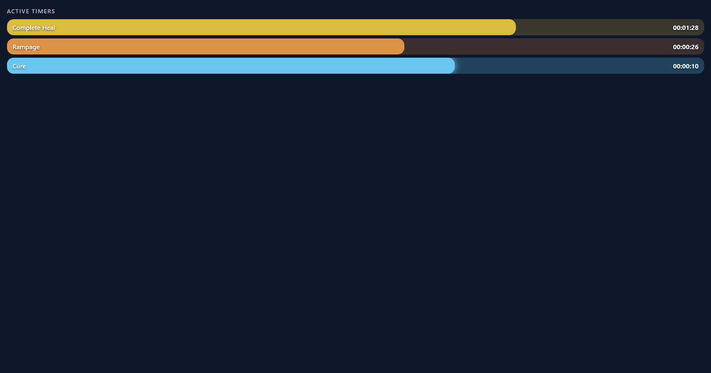
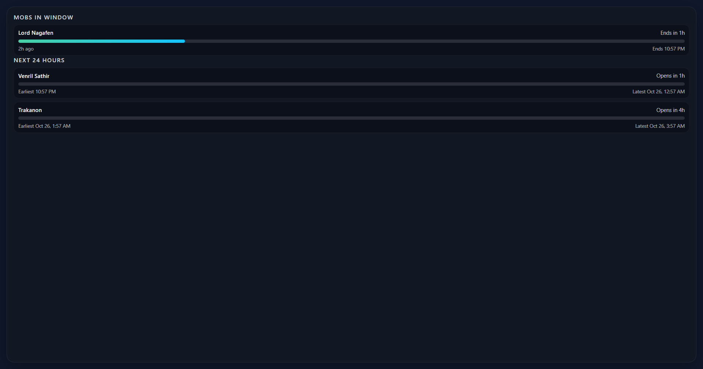

# EQGlobal Log Timer Overlay

Electron-based overlay that watches EverQuest log files, surfaces configurable timers similar to Gina, and forwards log data to a MongoDB Atlas–backed backend service.

## Downloads

- Latest Windows installer: visit Releases and download the newest tag.
  https://github.com/Tycee-Eecyt/EQGlobal/releases

## Auto-Update

- Packaged builds auto-check for updates on startup and every few hours.
- System tray includes “Check for Updates…”. After an update downloads it becomes “Restart to Update”.
- Updates are delivered via GitHub Releases.

## Prerequisites

- Node.js 18+ and npm
- MongoDB Atlas connection string (for the backend)
- EverQuest log directory accessible from this machine

## Initial Setup

1. Install dependencies:
   ```bash
   npm install
   ```
2. Copy `.env.example` to `.env` and adjust values:
   ```bash
   cp .env.example .env
   ```
   - `EQ_LOG_DIR` – default log directory to load when the app first launches.
   - `BACKEND_URL` – base URL for the backend service (e.g. `http://localhost:4000`).
   - `MONGODB_URI` / `MONGODB_DB` – Atlas credentials for the backend.
   - `PERSIST_LOG_EVENTS` – optional; set to `true` to persist trigger events (disabled by default).

## Running the Apps

- Start only the Electron overlay:
  ```bash
  npm run dev
  ```
- Start the backend service:
  ```bash
  npm run backend
  ```
- Run both together:
  ```bash
  npm start
  ```

## Electron Overlay Highlights

- Watches EverQuest log files (`*.log` and `eqlog_*.txt`) inside the configured `Logs` directory.
- Detects trigger phrases (plain text or regex) and tracks countdown timers.
- Transparent overlay stays on top; optionally allows clicks to pass through to the game.
- Control panel lists active timers, shows recent log lines, and manages triggers.
- Forwards raw log lines and trigger events to the backend in small batches.

## Screenshots

Control Panel


Timers Overlay


Mob Windows


## System Tray

- Show/Hide EQGlobal: toggles the main control window.
- Show/Hide Timer Overlay: toggles the timers overlay window.
- Show/Hide Mob Overlay: toggles the mob windows overlay.
- Check for Updates…: manually checks for new releases (packaged builds). When an update is downloaded, this becomes Restart to Update.
- Quit EQGlobal: exits the application.

### Configuring Triggers

Use the **Triggers** section in the control panel to add or edit entries. Each trigger supports:

- `Label` – display name in the overlay.
- `Pattern` – plain text match or regex (enable **Use Regex**).
- `Duration` – timer length in seconds.
- `Color` – tint for the overlay pill.

Click **Reset Defaults** to reload the sample trigger set from `src/shared/defaultTriggers.json`.

### Import GINA Packages (.gtp)

You can convert a GINA trigger package (`.gtp`) into this app’s JSON trigger format and use it as your trigger set.

- Place your `.gtp` file anywhere (e.g., `external/all-gina.gtp`).
- Run the converter script (Windows/PowerShell):

  ```bash
  npm run convert:gtp -- -InputPath external/all-gina.gtp -OutputPath external/all-gina.triggers.json
  ```

- The script extracts `ShareData.xml` from the archive and emits a JSON array with fields compatible with this app: `id`, `label`, `pattern`, `duration`, and optional `isRegex` + `flags` for regex triggers.

- To use the result, you have two options:
  - Replace the default triggers: copy the generated JSON into `src/shared/defaultTriggers.json` and restart the app.
  - Or edit your runtime `settings.json` (Electron userData folder) and set `triggers` to the converted JSON array, then restart.

Notes:
- Only triggers with a timer (`TimerDuration` or `TimerMillisecondDuration`) are included.
- Regex patterns are preserved and marked with `isRegex: true` and `flags: "i"` for case-insensitive matching.

### Export Current Triggers

- In the app UI, click `Export Triggers` in the Triggers panel.
- Choose a save location; a JSON file with your current trigger set is written.

### Category-to-Color Mapping

- When importing from GINA, trigger `Category` is preserved and used to auto-assign colors if a trigger lacks one.
- Known categories (e.g., `AoEs`, `Complete Heals`, `Cures`, `Death Touches`, `Gating`, `Rampage`, `Mob Spells`) map to distinct colors.
- Unknown categories receive a stable, generated color so groups remain visually consistent.

## Backend Service

`backend/server.js` exposes:

- `GET /health` – health probe, ensures MongoDB connectivity.
- `POST /api/log-lines` – accepts `{ lines: [{ filePath, line, timestamp }] }`.
- `POST /api/log-events` – accepts `{ events: [{ triggerId, label, duration, ... }] }`; by default events are acknowledged but not persisted unless `PERSIST_LOG_EVENTS=true`.

### Admin: Log Forwarding Triggers

- Visit `/admin.html` to manage which log lines are stored in the database.
- Create simple substring or regex-based triggers and enable/disable them.
- The backend only persists log lines matching at least one enabled trigger.
- `tod`/`!tod` commands are still parsed server-side to update Mob Windows, even if the raw line is not stored.

API endpoints:
- `GET /api/log-triggers` – list configured triggers.
- `POST /api/log-triggers` – create or upsert a trigger `{ label, pattern, isRegex, flags, enabled }`.
- `PUT /api/log-triggers/:id` – update a trigger.
- `DELETE /api/log-triggers/:id` – delete a trigger.
- `POST /api/log-triggers:test` – test a sample line against current triggers.

Data is stored in the `log_lines` collection. The `log_events` collection is not written to unless you opt in with `PERSIST_LOG_EVENTS=true`. Set `MONGODB_URI` before running or the server logs a warning and skips persistence.
Data is stored in the `log_lines` collection. The `log_events` collection is not written to unless you opt in with `PERSIST_LOG_EVENTS=true`. Set `MONGODB_URI` before running or the server logs a warning and skips persistence.

## Overlay Tips

- **Overlay opacity** slider adjusts transparency live.
- Enable **Allow game clicks through overlay** to make the window click-through while keeping timers visible.
- Press **Focus Overlay** if the overlay window gets hidden behind other apps.

## Bulk ToD Import

- In the Mob Windows view, paste Discord chatter with lines beginning with `!tod` or `tod` and click Preview/Apply.
- Supports explicit timestamps for both individual mobs and quake resets.
- Examples:
  - `!tod Trakanon now`
  - `!tod Trakanon 10/25/2025 6:48 PM`
  - `!tod quake now`
  - `!tod quake 2025-10-25 18:48`
- Time parsing accepts formats like `now`, `M/D/YYYY HH:MM [AM/PM]`, `YYYY-MM-DD HH:MM[:SS]`, or time-only (anchored to the message timestamp).
- A quake command applies the same timestamp to all tracked mobs.

## Next Steps

- Expand trigger configuration UI (import/export, categories).
- Add notification sounds or text-to-speech.
- Build visualization or analytics pages on top of the stored MongoDB data.
